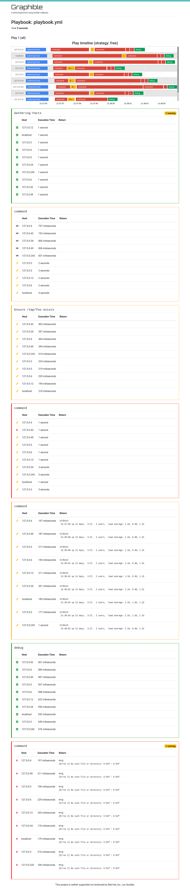

# Graphible

This was mainly just a weekend project/experiment to learn about Ansible
callback plugins. **This is just a spare-time project not endorsed or supported
by Ansible or Red Hat, Inc.** It's a toy.

It's entirely spaghetti code right now. Don't use it for anything serious.

The goal is to take a playbook run (or set of playbook runs) and create a
pretty HTML (bootstrap + google charts) page that shows how the execution went.

In practice, it's probably not terribly useful except for as a visualization
for how different Strategy plugins work. In theory, it could some day be used
as an ultra-simple replacement for ARA when you don't need to store previous
run history. But it is currently nowhere near ready for that.

## Pretty Screenshot

## Options

- `template_path` - Path to the directory containing the `index.html` template.
- `output_file_path` - Path to directory where `out.html` gets written.

## Things that need work

- A lot of the code is pure spaghetti right now. It needs to be rewritten to
  use classes instead of dicts for everything.
- It uses a bunch of internal Ansible stuff right now (think:
  `TaskResult._result._task._uuid`). Is there a better way?
- Warnings are currently per-task. They should be per host-result per task.
- The graph auto-height stuff is, like, really broken.
- It needs to show more useful return data. Right now it only shows a
  few (hardcoded) result keys if they exist.
- It needs more graphs. It's called Graphible, but only has one graph.

## License

GPLv3+, same as Ansible.
